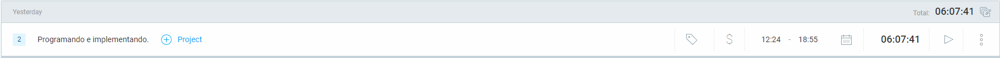

# Devlog Ajolote al Camote

Primero que nada, este proyecto fue un trabajo para el Taller de Diseño de Niveles II, a mediados del 2023. El equipo estuvo conformado por RayRay (https://ray-conceptartist.itch.io/), ... y Julián Abaroa (https://master00021.itch.io/). Lo diseñamos entre todos, y yo estuve a cargo del área de la programación. 

Ahora, tomaré este proyecto para rehacerlo y pulirlo.

## 15 de mayo de 2024

Este día me enfoqué en preparar todo el proyecto para su posterior edición, lo revisé por encima para hacerme una idea de cómo lo habíamos dejado. 

Me di cuenta de que lo tendré que rehacer completamente, hay muy pocas cosas salvables, algunas lógicas que había hecho hace 9 meses únicamente. Además, dentro de Unity, tendré que rehacer los niveles y el cómo estaban organizados.

## 16 de mayo de 2024

Este día pude avanzar un poco en la mañana, me dediqué a ordenar todos los scripts de forma superficial, ya sea agregando el namespace Game, declarando las clases como 'internal' o 'internal sealed', y otras cosas de orden de sintaxis que utilizo actualmente para ordenar mis trabajos.

Además, rehice algunas clases, mejorando la lógica y el cómo las conectaré entre sí.

## 17 de mayo de 2024

Hoy estuve dedicándome a revisar todos los scripts de la carpeta "Obstacles". Me di cuenta de que la mayoría de los scripts era básicamente la misma lógica, y que había uno en concreto, el de 'Bottle', que podía replicar la lógica de todos. Por lo tanto, borré todo el resto y cambié 'Bottle' por 'GenericMovement'. 

Por último, cambié un poco la clase padre 'Obstacle', ahora se activa el método 'CO_HorizontalMovement' por sí mismo. De esta forma, las clases hijas no tienen la responsabilidad de iniciar dicho método, evitando confusiones y errores a futuro, por no haber iniciado dicho método.

Quedé haciendo el movimiento de Onda del script 'VecticalWaveMovement', pero decidí dejarlo hasta aquí hoy. Estuve unas dos horas trabajando en el proyecto. 

## 18 de mayo de 2024

Hoy no tuve prácticamente tiempo para avanzar en este proyecto, apenas le pude dedicar unos 20 minutos. 

Pude resolver el mal funcionamiento del script 'VerticalWaveMovement'. Termine utilizando el método transform.Translate(), en vez de usar el 'transform.positon += valor'.

## 19 de mayo de 2024

Cree el script 'GameLifeCycle' para tener controlado el inicio del juego en sí, que servirá a futuro cuando tenga que manejar todos los flujos que tendrá el videojuego. 

Avance en el movimiento horizontal y vertical del jugador, siendo el vertical el que más me costó. Al ser un controlador tan simple, no quería que se sintiera "tieso" o "lento". 

Sara01-s (en GitHub) me pasó dos scripts en los que ella había trabajado hace un tiempo en el movimiento vertical de una 'nave'. 

Logre abstraer la idea de ambos y replicarlo, con mis conocimientos en mi código, lo cual no fue fácil. 

Consiste básicamente en utilizar la gravedad del rigidbody y no aplicarle una fuerza al mismo. 

Me pareció súper contra intuitivo, pero a la vez me hizo mucho sentido. Al final, en vez de aplicarle una fuerza para que el gameObject suba, se le aplica dicha fuerza a la gravityScale del rigidbody, y se invierte según se desee.

Como siempre, hay que guardar la dirección, y multiplicarla con la fuerza que se desee. Luego, modificar la escala de gravedad del rigidbody con dicho valor.

Lo único que quedaría sería limitar las velocidades del rigidbody.

Hoy estuve avanzando en la Tesis, así que tampoco tuve tanto tiempo hoy, habré estado apenas 1 hora.

## 20 de mayo de 2024

Hoy empecé trabajando con el script de Fish. 

Tuve problemas para entender las rotaciones de los gameObjects, quería que, si la rotación en Z era mayor a cierto rango representado entre dos float ('randomRotationAngle'), se invirtiera la dirección de la rotación. 

En internet, encontré el método 'NormalizeAngle(float angle)', el cual logré comprenderlo luego de ver videos sobre ángulos, restos de divisiones, entre otros. 

Básicamente, primero comprueba si el valor de 'angle' es mayor a una revolución (o mayor a 360 grados), para "resetearlo" a cero. Si se le pasan 398 grados, dará como resultado 38 grados, normalizando los valores dentro del rango 0-360 grados.

Luego, cuando la variable 'angle' sea mayor a la mitad de una revolución (180 grados), se restará una revolución entera. Ahora tiene sentido comparar el valor de 'angle' (tomando su valor absoluto) con el de 'randomRotationAngle'.

Me di cuenta de que Unity utiliza la convención a la hora de darle valores a las rotaciones en el Transform. Si se rota el gameObject en sentido antihorario, el valor aumentará, y si se gira en sentido horario, el valor disminuirá.

Testeé todos los scripts que he rehecho hasta ahora en una escena de Unity, y están funcionales.
Mañana seguiré avanzando, o eso espero. Hoy estuve 5 horas trabajando.

## 21 de mayo de 2024

He estado rehaciendo scripts sobre toda la lógica referente a los niveles.

Lo más destacable es cómo dividí los scripts, ahora mismo cada script se encarga solamente de un apartado del funcionamiento del nivel. 'LevelData' contiene los datos del nivel. 'LevelDataHandler' es una clase que heredarán todos los scripts que necesiten leer o escribir datos en 'LevelData'. 'LevelGoal' se encarga de terminar el nivel. 'LevelShells' se encarga de guardar en 'LevelData' las shells recolectadas por el jugador. Llevo 2 horas trabajando. 

Como el código ya está ordenado y rehecho casi en su totalidad, empezaré a editar las escenas de Unity y a hacer que todo funcione. Sé que habrá cosas en el código que no funcionarán como yo espero, o cosas que pasé por alto, pero el mismo nivel me irá diciendo que es lo que va necesitando, y yo lo iré solucionando o agregando.

Llevo otras 2 horas trabajando. El primer nivel está medianamente funcional, al menos los enemigos y los obstáculos. Todavía faltan las decoraciones y probablemente deba de cambiar un poco la rotación de los peces; tiene algunos comportamientos no deseados.

Después de 3 horas, el nivel uno está funcional, con decoraciones y todo, ahora creo que pasaré a los flujos de UI.

1 hora después, el 'VictoryUI' está funcionando, con los 'LevelData' del porcentaje completado y las Shells conseguidas.

## 24 de mayo de 2024

Estuve una media hora decorando el segundo nivel durante la mañana antes de ir al instituto.

En la tarde noche estuve avanzando una hora y media, dejando el nivel dos funcional.

## 25 de mayo de 2024

El nivel 3 ahora es funcional. Estuve trabajando una hora y media.

Deje un flujo de UI temporal del 'MainMenu' funcional, mas que nada para el diseño de las interfaces, que todo quedara como era en el proyecto del año pasado. Aun faltan varias cosas por hacer. Hoy trabaje unas 2 horas y media.

## 15 de julio de 2024

Ayer decidí volver a este proyecto y terminarlo de una vez por todas. El semestre fue complicado, pero pude gastar todo el día de ayer en finiquitar este proyecto.

Lo primero que empecé a hacer, fue la lógica de UI para la selección de niveles, lo cual no fue complicado y tomó poco tiempo. 

Luego me di cuenta de la necesidad de un sistema de guardado, el cual es bastante simple. Se compone de dos scripts principales: el primero es el 'DataSystem', el cual se encarga de obtener la ruta donde se guardarán o cargarán los datos. En el método 'SaveLevelData' toma el ScriptableObject y lo transforma a un archivo .json, y luego toma la ruta de los datos del nivel y escribe dichos datos en el archivo .json correspondiente.

También tuve que buscar todos los sonidos y canciones del juego de nuevo, debido a que no sabía las licencias de uso que tenían, las que usamos para la evaluación en taller. Me aseguré de que todas las canciones o sonidos tuvieran la licencia Creative Commons Zero (CC0) u otra que permitiera su uso gratuito.

Entre medio de todo eso, tuve que arreglar muchos problemas pequeños en la implementación y en el código, lo que consumió bastante tiempo. 

Finalmente, cree un apartado de créditos, para poner no solo al grupo con el que hice este proyecto, sino también para poner a aquellos que hicieron los sonidos y canciones que utilicé en el juego. 

Utilice Clockify (https://clockify.me/) para medir cuánto tiempo estuve trabajando ayer: (poco más de seis horas)

